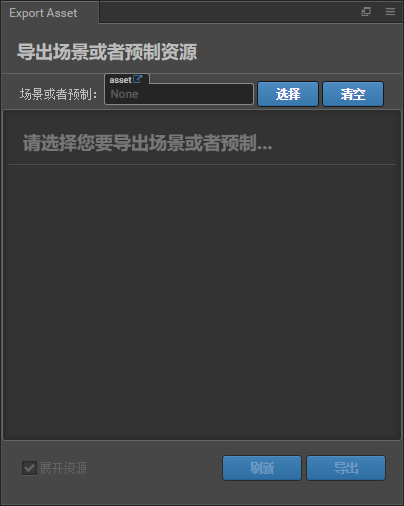

# H5 游戏开发

<small>[@LE](https://github.com/leer0911/)</small>

Note:
本次分享的目的是让大家对 H5 游戏开发有个初步的认识，并且可以独立开发一款小游戏。这边的 H5 只是泛指已实现 HTML5 规范的现代浏览器环境，跟我们之前理解的 H5 技术没什么关系。也就是说，本次分享并不是使用 html5 、css3 技术去开发游戏。

--

## 概要

- 游戏引擎

- 开发工具

- 开发思路

- 实战

---

# 游戏引擎

Note:
早期的游戏是没有游戏引擎这个概念的，都是一个游戏一套代码，后面才把这些重用代码封装起来，成为了早期的引擎。一般来说，游戏引擎的任务是对底层绘图接口的封装，以及资源，声音，性能等方面的处理。

--

## 为什么需要游戏引擎？

- 无需接触底层绘图接口，降低学习成本

- 提供常见功能和组件，提升开发效率

Note:
我们完全可以不用引擎，直接基于 DOM 来开发一款游戏，比如基于 React 开发俄罗斯方块，但这只是体验 React 生态以及游戏开发思路的一种方式。如果你想走得更快，更远，建议还是从使用并了解游戏引擎开始。

--

## 游戏引擎组成

通常会包含渲染器，2D/3D 图形元素，碰撞检测，物理引擎，声音，脚本，动画，粒子等模块。

Note:
游戏引擎一般是由 `C/C++` 开发的，如果要从零开发游戏引擎，必须对计算机图形学，OpenGL 和 DirectX 有所了解。( 我们是前端，对自己好一点。先学会怎么用吧。不然下次就得分享生发心得了。 )

--

## 适合前端的游戏引擎

- [Cocos2d-x](http://www.cocos.com/)

- [Egret](https://www.egret.com/index)

- [Pixi](http://www.pixijs.com/)

- [Phaser](http://phaser.io/)

- [ThreeJs](https://threejs.org/)

- [playcanvas](https://playcanvas.com/)

Note:
就好比我们使用 ORM 框架来操作数据库，无需关心 SQL 语句或其他底层细节。对于前端开发者来说，游戏引擎应该支持浏览器环境 ，并且可以用 Js 去调用底层接口。

--

## 如何选择 ?

- 游戏效果呈现方式

- 游戏复杂度

Note:
游戏的渲染方式一般有 2D 、3D 、VR ，所以在选择游戏引擎上可以将引擎提供的渲染方式作为选择标准。另外，2D 渲染包括 Dom 、Canvas 、WebGL ，也就是说不同的游戏引擎，提供的功能不一样。在分析游戏功能及复杂度后，就可以将游戏引擎能够支持的功能，提供的 API，性能等方面来作为选择标准。

--

## Cocos2d-x

- `Cocos2d-x` 是一个基于 OpenGL 的游戏引擎，因此它的绘图部分完全由 OpenGL 实现。

- OpenGL 是一个基于 C 语言的三维图形 API，基本功能包含绘制几何图形、变换、着色、光照、贴图等。

- 除了基本功能，OpenGL 还提供了诸如曲面图元、光栅操作、景深、shader 编程等高级功能。

Note:
另外 OpenGL 方便移植到移动端，但对于我们前端来说，可能只接触过 `WebGL`，WebGL 是基于 OpenGL ES 2.0 的 Javascript API。通过 HTML5 的 Canvas 来和 DOM 打交道。不过，目前看来，只有需要特殊滤镜的情况才可能接触这些底层的技术细节。这边不做过多赘述，后续会讲一个 shader 的 Demo。

--

### 特点

- Cocos2d-x 是 MIT 许可证下发布的一款功能强大的开源游戏引擎。

- 允许开发人员使用 C++、Javascript 及 Lua 三种语言来进行游戏开发。

- 支持所有常见平台，包括 iOS、Android、Windows、macOS、Linux。

--

## 游戏分类

- ACT=动作类
- RPG=角色扮演
- AVG=冒险类
- PUZ=益智类
- CAG=卡片类
- SPG=体育类
- SLG=战略类
- STG=射击类
- FTG=格斗类
- LVG=恋爱类
- TCG=养成类
- ...

Note:
游戏类型主要分为 6 类：动作、冒险、模拟、角色扮演、休闲和其他。细分的话，太多了。另外，国内的游戏开发商主要有：腾讯，网易和其他。也有一类叫做独立游戏，是由一些游戏开发爱好者自行开发的。那 cocos2d-x 能做哪些游戏呢，让我们来看一下它的代表作。

--

## Cocos2d-x 代表作


Note:
一些经典的游戏，如梦幻西游，保卫萝卜都是基于 cocos 开发的。

--


Note:
是时候给自己定一个小目标了，开发一个王者荣耀。直接开撸，算了，万丈高楼平地起。还是先从基础开始吧。

--

## 引擎中基础知识了解一下


Note:
引擎里面的一些基本概念都差不多。触类旁通，切换引擎的成本就只在于对引擎 API 的熟悉。

--

## 基本概念

- 导演

- 场景

- 精灵

- 脚本

Note:
不管是 cocos2d-x 还是其他引擎。都会有导演，场景，精灵，脚本等概念。相当于前端单页应用中的 Route，Document，DOM，JavaScript。

--

### 导演

导演(Director)的任务是控制场景替换和转换。

Note:
有点像路由切换

--

### 场景 / 舞台

好比电影里不同的故事情节。

Note:
每个不同的界面

--

### 精灵

- 精灵是您在屏幕上移动的对象，它能被控制。如果无法控制，那就只是一个节点(Node)。

- 它有一些可以被配置的属性，比如：位置，旋转角度，缩放比例，透明度，颜色 等等。

Note:
这些其实都只是术语，有个大概的了解即可，不必纠结其名称。

--

### 脚本

- 方便性

- 灵活性

Note:
游戏中为什么要用脚本呢！最简单解释就是灵活性好。
虽然只是几个简单的概念，但就仅仅开发具备这些功能的游戏引擎也是极难的。
对于 cocos2d-x 我们就先了解这么多，其他如物理引擎，碰撞检测，有兴趣的可以去了解下。

--

### 开始猜代码

```c++
auto dirs = Director::getInstance();
Size visibleSize = dirs->getVisibleSize();

auto myScene = Scene::create();

auto label1 = Label::createWithTTF("My Game", "Marker Felt.ttf", 36);
label1->setPosition(Vec2(visibleSize.width / 2, visibleSize.height / 2));

myScene->addChild(label1);

auto sprite1 = Sprite::create("mysprite.png");
sprite1->setPosition(Vec2(100, 100));

myScene->addChild(sprite1);
```

Note:
看到这个代码的时候，我差点忘记自己是一个前端! 这段代码是用来创建一个场景，场景里面有一个标签和一个精灵。这虽然很简单，但这却是 c++。即便 cocos2d-x 支持 JavaScript，但官方文档对此并不友好。

--

## 我只是个前端 !

Note:
前端近几年的发展让我们养成了查看文档的好习惯，而且是查看好的文档。如果是这样的生态，让一个前端去开发游戏。我选择去切图 !

--

### 成就你的梦想 ! 让游戏开发变得

# 简单!

Note:
看到 cocos 官网的这句标语，我就有要求了，

- 我要友好的文档，开发所见即所得。
- 我要结合 chrome 调试，用 vscode 开发。
- 我要组件化开发，数据驱动

--


Note:
后续会介绍组件化，模块化，数据驱动这几个概念。

---

# 开发工具

Note:
开发工具应该是一个完整的游戏开发解决方案，最好有个友好的 GUI。

--

## Cocos Creator

- 以内容创作为核心的游戏开发工具

- 包含从设计、开发、预览、调试到发布的整个工作流所需的全功能一体化编辑器

- 目前支持发布游戏到 Web、iOS、Android、各类"小游戏"、PC 客户端等平台，真正实现一次开发，全平台运行。

Note:
cocos creator 为前端而生

--

## 界面


--

## 人员配置

- 美术

- 策划

- 程序员

Note:
游戏公司一般会有美术，策划，程序员。

并且有具体分工，美术一般负责界面的设计与搭建，这样就不会扯皮像素级别的问题了。

程序员主要负责游戏逻辑的编写。

策划负责游戏玩法设计，由于 cocos creator 提供了属性配置功能，所以策划也可以通过它来修改一些游戏配置。

所以，如果美术，策划，程序员都会使用 cocos creator，将会极大地降低沟通成本。

--

## 工作流程


Note:
整个工作流程分为三个部分：

- UI 搭建
- 游戏逻辑编写
- 构建发布

--

## 资源相关

--

### 图像资源

- Texture

- SpriteFrame

Note:
Texture 是游戏中绝大部分图像渲染的数据源。而 SpriteFrame 是 Texture 的子资源，也是核心渲染组件 Sprite 所使用的资源。

--

### 图集资源

- 图集（Atlas）也称作 Sprite Sheet，是游戏开发中常见的一种美术资源。

- Cocos Creator 使用的图集资源由 plist 和 png 文件组成。

Note:
就像前端的雪碧图，但与雪碧图不一样的是。ccc 中的图集由 plist 和 png 组成。好比用 gulp 自动生成的雪碧图和 css。

--

### 图集工具

- [TexturePacker](https://www.codeandweb.com/texturepacker)

- [Zwoptex](https://zwopple.com/zwoptex/)

Note:
无力吐槽，我还是选择相信官方提供的自动图集

--

### 自动图集

Cocos Creator 自带的合图功能，自动图集资源将会以当前文件夹下的所有 SpriteFrame 作为碎图资源。


Note:
只有在构建发布后，才会启动合图功能。

--

### 其他

- 预制资源 (Prefab)

- 艺术数字资源 (LabelAtlas)

Note:
预制资源相当于游戏对象模板，可以实例化为多个游戏对象。是组件化的一种体现。并且适合资源导出。
艺术数字资源可用于一些特定的数字图片。

--

### 资源导入导出

Note:
资源导入导出有什么用呢，比如我们开发了一个排行榜这种可以共用的组件，这时就可以通过导入导出来实现在项目间的复用。

--

### 导出



--

### 导入


--

## 场景制作

Note:
还记得我们之前用 c++ 实现场景的那段代码不，用 cocos creator 可没那么复杂。
先来了解下场景制作相关知识点，最后你会发现，cocos creator 一直在帮我们完成一件事，
怎么用 canvas 绘制一个网页，以及对前端更友好。极大降低了开发成本。

--

### 节点

在 Cocos Creator 中，节点（Node）是承载组件的实体，我们通过将具有各种功能的组件（Component） 挂载到节点上，来让节点具有各式各样的表现和功能。

Note:
我们知道网页文档可以看作树形结构，那就有对应的节点。DOM 中有三大节点，分别为元素节点，文本节点，属性节点。
另外，在浏览器中， Web Components 技术，允许创建可重用的定制元素（它们的功能封装在您的代码之外）并且在您的 web 应用中使用它们。所以 cocos creator 中的节点，建议理解为元素比较合适。
--


--

### 现成控件


Note:
节点具备某些特定的表现和功能就可以称之为控件了。
可以看到，cocos creator 为我们提供了很多常用控件。并且可以自定义。
--

一个节点上只能添加一个渲染组件，渲染组件包括 Sprite（精灵）， Label（文字），Particle（粒子）等。

Note:
这个很好理解，如果一个节点上包括多个渲染组件。那渲染器都不知道要做什么了 !
--

### 组件

- Cocos Creator 的工作流程是以组件式开发为核心

- 组件式架构也称作组件-实体系统（或 Entity-Component System）

Note:
一个实体指的是存在于你的游戏世界中的物体。实体在代码上就是一个组件的列表。正如之前所说，节点只是组件的载体。
--


Note:
cocos creator 提供的组件有：碰撞组件，物理组件，渲染组件，UI 组件，脚本组件，动画组件，声音组件，摄像机组件等。

--

## 坐标系

Note:
cocos creator 下的坐标系统跟浏览器存在差别

--

### Cocos Creator 坐标系

- Cocos Creator 的坐标系和 cocos2d-x 引擎坐标系完全一致，而 cocos2d-x 和 OpenGL 坐标系相同，都是起源于笛卡尔坐标系。

- 笛卡尔坐标系中定义右手系原点在左下角，x 向右，y 向上，z 向外，我们使用的坐标系就是笛卡尔右手系。

## 

--

### 屏幕坐标系和 cocos2d-x 坐标系


--

### 世界坐标系（World Coordinate）和本地坐标系（Local Coordinate）


Note:
世界坐标系也叫做绝对坐标系，在 Cocos Creator 游戏开发中表示场景空间内的统一坐标体系，「世界」就用来表示我们的游戏场景。
本地坐标系也叫相对坐标系，是和节点相关联的坐标系。每个节点都有独立的坐标系，当节点移动或改变方向时，和该节点关联的坐标系将随之移动或改变方向。
Cocos Creator 中的 节点（Node） 之间可以有父子关系的层级结构，我们修改节点的位置（Position） 属性设定的节点位置是该节点相对于父节点的本地坐标系而非世界坐标系。最后在绘制整个场景时 Cocos Creator 会把这些节点的本地坐标映射成世界坐标系坐标。

--

## 锚点（Anchor）


Note:

- 锚点（Anchor） 是节点的另一个重要属性，它决定了节点以自身约束框中的哪一个点作为整个节点的位置。我们选中节点后看到变换工具出现的位置就是节点的锚点位置。

- 锚点位置确定后，所有子节点就会以 锚点所在位置 作为坐标系原点，注意这个行为和 cocos2d-x 引擎中的默认行为不同，是 Cocos Creator 坐标系的特色！

结合 `transform-origin` 来理解比较好

--

## 节点层级和显示顺序

Note:
当场景中的元素越来越多时，我们就需要通过节点层级来将节点按照逻辑功能归类，并按需要排列他们的显示顺序。

--

### 节点树


Note:
通过层级管理器或运行时脚本的操作，建立的节点之间的完整逻辑关系，就叫做节点树。

--

### 节点树有什么用?


Note:
比如我们要创建一个角色，有网页开发经验的应该可以理解左边显示的节点关系。

- 管理节点逻辑关系
- 管理节点渲染顺序

--

## 脚本相关

Cocos Creator 的脚本主要是通过**扩展组件**来进行开发的

Note:

- 在组件脚本的编写过程中，可以通过声明属性，将脚本中需要调节的变量映射到属性检查器（Properties） 中

- 可以通过注册特定的回调函数，来帮助你初始化，更新甚至销毁节点。

--

## 生命周期回调

- onLoad
- start
- update
- lateUpdate
- onDestroy
- onEnable
- onDisable

Note:
Cocos Creator 为组件脚本提供了生命周期的回调函数。用户只要定义特定的回调函数，Creator 就会在特定的时期自动执行相关脚本，用户不需要手工调用它们。

--

## 常用脚本

Note:
cocos creator 提供的 API 还是比较多的，刚开始建议用到的时候再查找一下，这里简单过下常用的。

--

### 节点

```ts
@ccclass
export default class Child extends Parent {
  @property(cc.Node)
  node: cc.Node = null;

  // onLoad () {}
  start() {
    const node = this.node;
  }

  // update (dt) {}
}
```

Note:

- 获得组件所在的节点很简单，只要在组件方法里访问 `this.node` 变量

- 利用属性检查器设置节点

--

## 创建和销毁节点

```ts
@ccclass
export default class Child extends Parent {
  @property(cc.Prefab)
  prefab: cc.Prefab = null;

  // onLoad () {}
  start() {
    const node = new cc.Node();
    const copyNode = cc.instantiate(node);
    const prefabNode = cc.instantiate(this.prefab);
    node.destroy();
  }

  // update (dt) {}
}
```

Note:
这些创建出来的节点，必须加入场景中才有效果。

- 通过 `new cc.Node()` 并将它加入到场景中，可以实现整个创建过程。

- 有时我们希望动态的克隆场景中的已有节点，我们可以通过 `cc.instantiate` 方法完成。

- 和克隆已有节点相似，你可以设置一个预制（Prefab）并通过 `cc.instantiate` 生成节点。

- 通过 `node.destroy()` 函数，可以销毁节点。

--

### 运行时动态获取其它对象

```ts
import script from 'script';

@ccclass
export default class Child extends Parent {
  @property(script)
  comp: script = null;

  // onLoad () {}
  start() {
    console.log(this.node.children);
    console.log(this.node.getChildByName('Cannon 01'));
    console.log(cc.find('Canvas/Home'));
  }

  // update (dt) {}
}
```

Note:

- 查找子节点 `this.node.children`，或 `this.node.getChildByName("Cannon 01");`

- 如果子节点的层次较深，你还可以使用 `cc.find`

--

### 组件

```ts
import script from 'script';

@ccclass
export default class Child extends Parent {
  @property(script)
  comp: script = null;

  // onLoad () {}
  start() {
    this.node.getComponent('ScriptName');
  }

  // update (dt) {}
}
```

Note:

- `getComponent` 这个 API，它会帮你查找你要的组件。

- 利用属性检查器设置组件 (不需要再自己调用 getComponent)

--

## 加载和切换场景

```Ts
//创建常驻节点，用于多场景情况下资源和参数传递。
cc.game.addPersistRootNode(myNode)

// 场景加载回调
cc.director.loadScene("MyScene", onSceneLaunched);

// 预加载场景
cc.director.preloadScene('table', function() {
  cc.log('Next scene preloaded');
});
```

Note:
引擎同时只会运行一个场景，当切换场景时，默认会将场景内所有节点和其他实例销毁。

--

## 动态加载资源

```ts
// 加载 Prefab
cc.loader.loadRes('test assets/prefab', (err, prefab) {
  var newNode = cc.instantiate(prefab);
  cc.director.getScene().addChild(newNode);
});

// 加载 AnimationClip
cc.loader.loadRes('test assets/anim', (err, clip)=> {
  self.node.getComponent(cc.Animation).addClip(clip, 'anim');
});
```

--


Note:
动态加载资源要注意两点，一是所有需要通过脚本动态加载的资源，都必须放置在 resources 文件夹或它的子文件夹下。resources 需要在 assets 文件夹中手工创建，并且必须位于 assets 的根目录

--

## 监听和发射事件

```ts
@ccclass
export default class Child extends Parent {
  @property(script)
  comp: script = null;

  // onLoad () {}
  start() {
    this.node.on('mousedown', event => {
      console.log('Hello!');
    });
  }

  // update (dt) {}
}
```

Note:
事件处理是在节点（cc.Node）中完成的。对于组件，可以通过访问节点 this.node 来注册和监听事件。监听事件可以 通过`this.node.on()` 函数来注册

--

## 节点系统事件

- Cocos Creator 支持的系统事件包含鼠标、触摸、键盘、重力传感四种

- 系统事件遵守通用的注册方式，开发者既可以使用枚举类型也可以直接使用事件名来注册事件的监听器，事件名的定义遵循 DOM 事件标准。

--

- 'position-changed' 当位置属性修改时
- 'rotation-changed' 当旋转属性修改时
- 'scale-changed' 当缩放属性修改时
- 'size-changed' 当宽高属性修改时
- 'anchor-changed' 当锚点属性修改时

--

## 全局系统事件

```ts
@ccclass
export default class Child extends Parent {
  @property(script)
  comp: script = null;

    onLoad () {
        // open Accelerometer
        cc.systemEvent.setAccelerometerEnabled(true);
        cc.systemEvent.on(cc.SystemEvent.EventType.DEVICEMOTION, this.onDeviceMotionEvent, this);
    },

    onDestroy () {
        cc.systemEvent.off(cc.SystemEvent.EventType.DEVICEMOTION, this.onDeviceMotionEvent, this);
    },

    onDeviceMotionEvent (event) {
        cc.log(event.acc.x + "   " + event.acc.y);
    },
  // update (dt) {}
}
```

Note:
全局系统事件是指与节点树不相关的各种全局事件，由 `cc.systemEvent` 来统一派发.

--

## 动作系统

- 基础动作

- 容器动作

Note:
Cocos Creator 提供的动作系统源自 Cocos2d-x，API 和使用方法均一脉相承。动作系统可以在一定时间内对节点完成位移，缩放，旋转等各种动作。

--

```ts
this.jumpAction = cc
  .sequence(
    cc.spawn(cc.scaleTo(0.1, 0.8, 1.2), cc.moveTo(0.1, 0, 10)),
    cc.spawn(cc.scaleTo(0.2, 1, 1), cc.moveTo(0.2, 0, 0)),
    cc.delayTime(0.5),
    cc.spawn(cc.scaleTo(0.1, 1.2, 0.8), cc.moveTo(0.1, 0, -10)),
    cc.spawn(cc.scaleTo(0.2, 1, 1), cc.moveTo(0.2, 0, 0))
    // 以1/2的速度慢放动画，并重复5次
  )
  .speed(2)
  .repeat(5);
```

Note:

- 顺序动作 cc.sequence

- 同步动作 cc.spawn 同步动作可以同步执行对一系列子动作，子动作的执行结果会叠加起来修改节点的属性。

- 重复动作 cc.repeat 重复动作用来多次重复一个动作。

- 永远重复动作 cc.repeatForever 顾名思义，这个动作容器可以让目标动作一直重复，直到手动停止。

- 速度动作 cc.speed 速度动作可以改变目标动作的执行速率，让动作更快或者更慢完成。

--

```ts
// 动作回调可以用以下的方式声明：
const finished = cc.callFunc(this.myMethod, this, opt);

// 缓动;
const action = cc.scaleTo(0.5, 2, 2);
action.easing(cc.easeIn(3.0));
```

Note:
缓动动作不可以单独存在，它永远是为了修饰基础动作而存在的，它可以用来修改基础动作的时间曲线，让动作有快入、缓入、快出或其它更复杂的特效。需要注意的是，只有时间间隔动作才支持缓动

--

## 使用对象池

```ts
@ccclass
export default class Child extends Parent {
  @property(script)
  comp: script = null;

  onLoad () {
    this.enemyPool = new cc.NodePool();
    let initCount = 5;
    for (let i = 0; i < initCount; ++i) {
      let enemy = cc.instantiate(this.enemyPrefab); // 创建节点
      this.enemyPool.put(enemy); // 通过 putInPool 接口放入对象池
    }
  },
  createEnemy (parentNode) {
    let enemy = null;
    if (this.enemyPool.size() > 0) { // 通过 size 接口判断对象池中是否有空闲的对象
        enemy = this.enemyPool.get();
    } else { // 如果没有空闲对象，也就是对象池中备用对象不够时，我们就用 cc.instantiate 重新创建
        enemy = cc.instantiate(this.enemyPrefab);
    }
    enemy.parent = parentNode; // 将生成的敌人加入节点树
    enemy.getComponent('Enemy').init(); //接下来就可以调用 enemy 身上的脚本进行初始化
}
  onEnemyKilled (enemy) {
    // enemy 应该是一个 cc.Node
    this.enemyPool.put(enemy); // 和初始化时的方法一样，将节点放进对象池，这个方法会同时调用节点的 removeFromParent
  }
  // update (dt) {}
}
```

Note:
在运行时进行节点的创建(cc.instantiate)和销毁(node.destroy)操作是非常耗费性能的，因此我们在比较复杂的场景中，通常只有在场景初始化逻辑（onLoad）中才会进行节点的创建，在切换场景时才会进行节点的销毁。

--

## 脚本执行顺序

- 使用统一的控制脚本来初始化其他脚本

- 在 Update 中用自定义方法控制更新顺序

- 控制同一个节点上的组件执行顺序

  <small>在同一个节点上的组件脚本执行顺序，可以通过组件在 属性检查器 里的排列顺序来控制。</small>

- 还可以直接设置组件的 executionOrder。executionOrder 会影响组件的生命周期回调的执行优先级。

--

## 模块化脚本

- Cocos Creator 中的 JavaScript 使用和 Node.js 几乎相同的 CommonJS 标准来实现模块化

- ES6 或 TS

--

## 代码分包加载


Note:
分包加载，即把游戏内容按一定规则拆分在几个包里，在首次启动的时候只下载必要的包，这个必要的包称为 主包，开发者可以在主包内触发下载其他子包，这样可以有效降低首次启动的消耗时间。

Cocos Creator 的分包是以文件夹为单位来配置的，当我们选中一个文件夹时，在 属性检查器 中会出现文件夹的相关配置选项

--

## 插件脚本


Note:
比如我们编写了调用客户端协议的脚本，那就可以通过插件的形式来引入。

但是要注意，游戏脱离编辑器运行时，插件脚本将直接运行在全局作用域，脚本内不在任何函数内的局部变量都会暴露成全局变量，请小心因此引发的全局变量污染。

--

## Camera 摄像机

摄像机是玩家观察游戏世界的窗口，场景中至少需要有一个摄像机，也可以同时存在多个摄像机。创建场景时，Creator 会默认创建一个名为 Main Camera 的摄像机，作为这个场景的主摄像机。

Note:
摄像机的应用在后续会深入介绍。

--

## 多分辨率适配方案

- UI 节点都挂在 canvas 下。

- Widget（对齐挂件）放置在渲染元素上，根据需要将元素对齐父节点的不同参考位置。


Note:
Canvas（画布）组件随时获得设备屏幕的实际分辨率并对场景中所有渲染元素进行适当的缩放。

--


Note:
另外 cocos creator 提供的 Label（文字）组件内置了各种动态文字排版功能，文字会根据需要呈现完美的排版效果。

Sliced Sprite（九宫格精灵图）则提供了可任意指定尺寸的图像，同样可以满足各式各样的对齐要求，在任何屏幕分辨率上都显示高精度的图像。

--

# Tips

- 使用 Canvas 作为渲染根节点，Canvas 能提供多分辨率**自适应的缩放功能**

- 逻辑节点放置在场景根层级，**和 Canvas 节点并列**

- 可以将属性的默认值由 null 改为数组[]，这样你就能在属性检查器中**同时设置多个对象**。

- 注意: **在 cc.callFunc 中不应该停止自身动作**，由于动作是不能被立即删除，如果在动作回调中暂停自身动作会引发一系列遍历问题，导致更严重的 bug。

- ...

Note:
调用一个节点的 removeFromParent 后，它不一定就能完全从内存中释放，因为有可能由于一些逻辑上的问题，导致程序中仍然引用到了这个对象。因此如果一个节点不再使用了，请直接调用它的 destroy 而不是 removeFromParent。destroy 不但会激活组件上的 onDestroy，还会降低内存泄露的几率，同时减轻内存泄露时的后果。
--

--

## 比较重要 API

- cc.game
- cc.director
- cc.Node
- cc.instantiate
- cc.NodePool
- cc.Prefab
- cc.loader
- cc.Component
- cc.Event

--

- cc.Asset
- cc.Texture2D
- cc.SpriteFrame
- cc.AnimationClip
- cc.ActionInterval
- cc.ActionInstant
- cc.ActionEase

--

# 性能


--

1. 雪碧图，图片按尺寸加载

2. prefab 和 对象池

3. 合理创建节点，控制节点数量

4. 视频和音频的处理独立出来一个单独的进程处理

5. Cocos Creator 2.0 性能至上，创作为先

6. CPU 瓶颈通常跟 Draw call 数量和你的游戏循环的复杂度相关

7. ...

---

# 开发思路

--


--

## 核心思想

- 面向对象 / 组件化

- 数据驱动

Note:
这个应该适用于前端开发的很多领域，首先，一切皆对象。对象，都具备属性和方法。一个游戏角色就是一个对象，但在 cocos creator 游戏开发中，比较少用到继承。更多的是之前讲到过的组件式开发。

另外，就是应该有数据驱动的思想，换句话说，应该理解游戏中的状态机。这个是一个比较深的话题，以后有机会再分享。

--

## 各有套路

Note:
每个游戏都有其理论基础，当我们要开发一款游戏的时候，一般会对游戏的玩法进行分析，进而抽象成数据与UI相互转换的过程。

下面先来看几个游戏。

--

- [2048](https://test-bfe.meiyou.com/game/2048/)
- [六边形消除游戏](https://test-bfe.meiyou.com/game/hex/)
- [头脑吃鸡](https://test-bfe.meiyou.com/game/iqpk/)

--

## 消除类


Note:
六边形游戏本质是俄罗斯方块，单从玩法上出发，这个游戏要实现
主要3个部分，棋盘生成，方块生成，胜负判定。

--


```js
hex2pixel(hex, h) {
  let size = h / 2;
  let x = size * Math.sqrt(3) * (hex.q + hex.r / 2);
  let y = ((size * 3) / 2) * hex.r;
  return cc.p(x, y);
}
```

Note:
细心的同学会发现，这六角网格其实也是一个坐标系。但是，我们平常接触的都是像素，因此这里需要一层转换。

--


--


Note:
接下来就是一些特定的形状生成，依旧是按照之前讲的这套六角网格来生成。

--

## 消除逻辑与胜负判定


Note:
之前说过，这类消除游戏其实就是俄罗斯方块。玩过俄罗斯方块的应该都知道，当方块拼满一行即完成消除。这时，我们可以借助数组来存储消除规则，之前，我们通过网格生成棋盘，其实相当于生成了一个数组。也就是0-60，这样便可以得到以左斜，水平，右斜，这几个方向的索引组合。

接着，胜负逻辑就可以在落子后，循环判断当前方块是否可以放入棋盘剩余位置即可。

另外这边值得关注的点，cocos creator 坐标系之间的转换。

--

- `convertToNodeSpaceAR` 将一个点转换到节点 (局部) 空间坐标系，这个坐标系以锚点为原点。

- `convertToWorldSpaceAR` 将节点坐标系下的一个点转换到世界空间坐标系。

Note:
如果理解了之前讲的 cocos creator 坐标系统，加上这些 API 的应用，可以解决很多节点位置关系检测的问题。相比，网页里的坐标系统，这个会有好很多。至少没有兼容问题。

至此，一个消除类游戏的开发思路就讲完了。这也是我接触游戏开发以来完成的第一个游戏，有写一篇更为详细的教程。有兴趣的可以看下。
- [六边形开发教程](https://github.com/leer0911/myHex)

--


Note:
这种答题类的，逻辑不会那么复杂。主要是动画的处理。事实证明，代码多复杂不重要，关键界面要好看。

--

### 背景无缝滚动


Note:
有没有轮播或走马灯的既视感，没错。原理差不多。两张图片交替交替衔接移动，就会给人一种镜头跟随的效果。

--

### 动画需知

- cocos creator 中有自带的动画编辑器，可以根据贝赛尔曲线来规定运动轨迹和缓动函数。

- 编辑预制体的动画，注意动画和预制体都要保存才能预览。

- 动画有帧事件回调。

--

### async 和 await

- async 和 await 可以严格控制顺序，

- Promise 顺序处理

```js
function sequenceTasks(tasks) {
    function recordValue(results, value) {
        results.push(value);
        return results;
    }
    var pushValue = recordValue.bind(null, []);
    return tasks.reduce(function (promise, task) {
        return promise.then(task).then(pushValue);
    }, Promise.resolve());
}

```

Note:
当遇到，动画是按顺序或者存在某种规律运行时，可以参考该类实现。

--

### AI 实现

- 随机左右跑动

- 均匀站队

Note:
其实目前依然没有实现真正意义上的 AI，目前的处理方式是，首先把左右两边规定为两个数组。有点类似正方形棋盘，事先定义好数据结构。然后随机抽取左右两边的角色进行互换，同时随机动画时间。这样就实现了随机答题站队。

--

### 其他

- 摄像机

- 物理引擎

- 粒子系统

- shader

Note:
截止目前，我们讲的都是益智类的游戏。但男生多少还是比较喜欢动作片。

--

## 2D 横版游戏摄像机运镜原理


Note:
如何才能更好地呈现一个单屏无法完全显示的大场景? 这是就要用到摄像机配合 卷轴，或者说运镜技术.

--

## 跟随操作


Note:
像迷魂车（Rally-X） 这样一款 1980 年出品的游戏,使用了最基础的固定位置（postion-locking）机制，使车子始终保持在画面正中，摄像机运动也完全可以预判。

--


Note:
成龙踢馆这款游戏使用了边缘捕捉（edge-snapping）机制，在这种机制下，当角色到达关卡尽头时，摄像机会尽量与场景边缘贴齐，使得玩家能够离开原本所在的锚点。

--


Note:
固定位置（postion-locking）虽然简单但仍然十分有用。对于像是泰拉瑞亚（Terraria）这样的建造冒险游戏，由于其角色的尺寸和跳跃的高度相对整个屏幕来说都很小，因此这种机制表现良好，能够在各个方向上都提供开阔的视野。

--

## 捕捉


Note:
在近期的游戏中我们也还能看到摄像机窗格（camera-window）技术的运用。来看看《菲斯》（Fez）是如何做的:当玩家旋转场景时，水平的摄像机窗格（camera-window）位置会保持不变，而精心挑选的转轴能让角色仍然位于窗格内部。

--


Note:
还有一种利用摄像机营造戏剧感，吸引注目的方法，即利用玩家触发来出发预设的摄像机运镜。《我是东巴》（Tomba!）是早期 PS 2.5D 游戏中颇为有趣的一款。通常摄像机会笔直向前拍摄，但当玩家执行某些操作后，如攀爬或在不同深度间移动时，它会稍微偏向另一个角度。当摄像机角度偏移时，能够让玩家感受到独特的操作感，也提供了更开阔的前方视野。

--

## 小结


Note:
摄像机在游戏中的运用还有非常多，单从这个就可以开发出很多我们儿时玩过的游戏。我想借这个机会说一下，无论是网页开发，还是游戏开发，所谓的思路其实还是那些基本的原理衍生出来的套路。比如网页开发，如果我们对浏览器的工作原理以及 V8引擎有一定的了解，那无论是对三大框架的理解还是处理兼容性，应该都有很大的帮助。

---

# 实战

---

# 参考

- [H5 游戏开发：游戏引擎入门推荐](https://aotu.io/notes/2017/12/27/h5-game-engine-recommend/)
- [基于 React 开发的俄罗斯方块](https://github.com/chvin/react-tetris)
- [如何从零开始写一个简单的游戏引擎？](https://www.zhihu.com/question/25668562)
- [理解 组件-实体-系统](https://blog.csdn.net/i_dovelemon/article/details/25798677)
- [独立游戏](https://www.indienova.com/)
- [如何学好游戏编程](https://blog.csdn.net/rabbit729/article/details/7014170)
- [官方性能优化](https://zilongshanren.com/blog/2016-07-24-optimize-graphics-performance-of-cocos2d-x-games.html)
- [H5 游戏开发](https://aotu.io/cates/H5%E6%B8%B8%E6%88%8F%E5%BC%80%E5%8F%91/index.html)

--

- [六边形网格](https://indienova.com/indie-game-development/hex-map-part-1/)
- [2D 横版游戏摄像机运镜原理与实践](https://indienova.com/indie-game-development/scroll_back_the_theory_and_practice_of_cameras_in_sidescrollers-ph/)
- [A 星算法详解](https://blog.csdn.net/zhulichen/article/details/78786493)
- [如何使 A \*寻路适应 2D 网格平台：理论](https://indienova.com/indie-game-development/how-to-adapt-a-pathfinding-to-a-2d-grid-based-platformer-theory/)
- [捕鱼类游戏计算方式的设计思路](http://www.cocoachina.com/game/20151016/13785.html)
- [状态机](https://indienova.com/indie-game-development/finite-state-machines/)


--

- [六边形开发教程](https://github.com/leer0911/myHex)

---

# Thanks!
