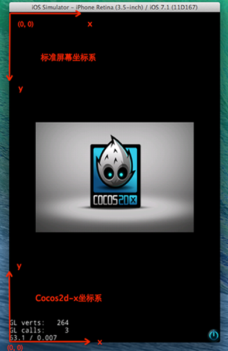

# H5 游戏开发

- 游戏引擎

- 开发工具

- 开发思路

- 上手体验

<small>Created by [@LE](https://github.com/leer0911/) / [github](https://github.com/leer0911/)</small>

---

## 游戏引擎

--

### 为什么需要游戏引擎？

游戏引擎实际上是用来开发游戏的一个跨平台图形（OpenGL）接口库，并提供常见功能和组件，极大地缩短了开发时间，让游戏开发变得更简单

--

### 游戏引擎组成

通常会包含渲染器，2D/3D 图形元素，碰撞检测，物理引擎，声音，脚本，动画等模块。

--

### 目前比较流行的 JS 游戏引擎

- [Cocos2d-x](http://www.cocos.com/)

- [Egret](https://www.egret.com/index)

- [Pixi](http://www.pixijs.com/)

- [Phaser](http://phaser.io/)

- [ThreeJs](https://threejs.org/)

- [playcanvas](https://playcanvas.com/)

--

### 如何选择 ?

- 游戏效果呈现方式

  <small>H5 游戏渲染： 2D 、3D 、VR ，2D 渲染：Dom 、Canvas 、WebGL 。</small>

- 游戏复杂度

  <small>这与游戏引擎能够支持的功能，提供的 API，性能等方面关系比较大。</small>

--

### Cocos2d-x

- Cocos2d-x 是 MIT 许可证下发布的一款功能强大的开源游戏引擎。

- 允许开发人员使用 C++、Javascript 及 Lua 三种语言来进行游戏开发。

- 支持所有常见平台，包括 iOS、Android、Windows、macOS、Linux。

--

### 以 Cocos2d-x 为基础开发的游戏


--


--

### 游戏引擎的一些基础知识

--

### 核心概念

- 导演

- 场景

- 精灵

- 动作

- 节点

--

### 导演

导演(Director)的任务是控制场景替换和转换。

--

### 场景

好比电影，由不同场景或故事线组成的故事情节。

--

### 精灵

- 精灵是您在屏幕上移动的对象，它能被控制。如果无法控制，那就只是一个节点(Node)。

- 它有一些可以被配置的属性，比如：位置，旋转角度，缩放比例，透明度，颜色 等等。

---

## 开发工具

--

开发工具应该是一个完整的游戏开发解决方案，并提供能让你更快速开发游戏所需要的各种图形界面工具

--

## Cocos Creator

- 以内容创作为核心的游戏开发工具

- 包含从设计、开发、预览、调试到发布的整个工作流所需的全功能一体化编辑器

- 目前支持发布游戏到 Web、iOS、Android、各类"小游戏"、PC 客户端等平台，真正实现一次开发，全平台运行。

--

## 界面

- 层级管理器
- 资源管理器
- 属性检查器
- 场景编辑器
- 动画编辑器
- 控制台

--

## 菜单

- 文件
- 编辑
- 节点
- 组件
- 项目
- 面板
- 布局
- 扩展
- 开发者
- 帮助

--

## 常用快捷键

- 移动节点 position (W)
- 旋转节点 rotation (E)
- 缩放节点 scale (R)
- 矩形变换工具修改节点 size 和 position (T)

--

## 工作流程


--

## 资源相关

--

### 图像资源 (Texture)

- Texture

  游戏中绝大部分图像渲染的数据源。

- SpriteFrame

  Texture 的子资源，核心渲染组件 Sprite 所使用的资源。

--

### 图集资源 (Atlas)

- 图集（Atlas）也称作 Sprite Sheet，是游戏开发中常见的一种美术资源。

- Cocos Creator 使用的图集资源由 plist 和 png 文件组成。

--

### 图集工具

- [TexturePacker](https://www.codeandweb.com/texturepacker)

- [Zwoptex](https://zwopple.com/zwoptex/)

--

### 自动图集

Cocos Creator 自带的合图功能，自动图集资源将会以当前文件夹下的所有 SpriteFrame 作为碎图资源。


--

### 图集打包策略

- BestShortSideFit

- BestLongSideFit

- BestAreaFit

- BottomLeftRule

- ContactPointRule

--

### 其他

- 预制资源 (Prefab)

- 艺术数字资源 (LabelAtlas)

--

### 资源导入导出

--

### 导出


--

### 导入


--

## 场景制作

--

### 节点

在 Cocos Creator 中，节点（Node）是承载组件的实体，我们通过将具有各种功能的组件（Component） 挂载到节点上，来让节点具有各式各样的表现和功能。

--


--

一个节点上只能添加一个渲染组件，渲染组件包括 Sprite（精灵）， Label（文字），Particle（粒子）等。

--

### 组件

- Cocos Creator 的工作流程是以组件式开发为核心

- 组件式架构也称作组件-实体系统（或 Entity-Component System）

- [理解 组件-实体-系统](https://blog.csdn.net/i_dovelemon/article/details/25798677)

<small>一个实体指的是存在于你的游戏世界中的物体。实体在代码上就是一个组件的列表。<small>

--

## 坐标系和节点变换属性

--

### Cocos Creator 坐标系

- Cocos Creator 的坐标系和 cocos2d-x 引擎坐标系完全一致，而 cocos2d-x 和 OpenGL 坐标系相同，都是起源于笛卡尔坐标系。

- 笛卡尔坐标系中定义右手系原点在左下角，x 向右，y 向上，z 向外，我们使用的坐标系就是笛卡尔右手系。

## 

--

### 屏幕坐标系和 cocos2d-x 坐标系



--

### 世界坐标系（World Coordinate）和本地坐标系（Local Coordinate）


--

世界坐标系也叫做绝对坐标系，在 Cocos Creator 游戏开发中表示场景空间内的统一坐标体系，「世界」就用来表示我们的游戏场景。

--

本地坐标系也叫相对坐标系，是和节点相关联的坐标系。每个节点都有独立的坐标系，当节点移动或改变方向时，和该节点关联的坐标系将随之移动或改变方向。

--

Cocos Creator 中的 节点（Node） 之间可以有父子关系的层级结构，我们修改节点的位置（Position） 属性设定的节点位置是该节点相对于父节点的本地坐标系而非世界坐标系。最后在绘制整个场景时 Cocos Creator 会把这些节点的本地坐标映射成世界坐标系坐标。

--

### 锚点（Anchor）

- 锚点（Anchor） 是节点的另一个重要属性，它决定了节点以自身约束框中的哪一个点作为整个节点的位置。我们选中节点后看到变换工具出现的位置就是节点的锚点位置。

- 锚点位置确定后，所有子节点就会以 锚点所在位置 作为坐标系原点，注意这个行为和 cocos2d-x 引擎中的默认行为不同，是 Cocos Creator 坐标系的特色！

--

### 变换属性

- 锚点（Anchor）

- 位置（Position）

- 旋转（Rotation）

- 缩放（Scale）

--

## 管理节点层级和显示顺序

--

当场景中的元素越来越多时，我们就需要通过节点层级来将节点按照逻辑功能归类，并按需要排列他们的显示顺序。

--

### 节点树

通过层级管理器或运行时脚本的操作，建立的节点之间的完整逻辑关系，就叫做节点树。

--


--

### 节点树有什么用?

- 管理节点逻辑关系
- 管理节点渲染顺序

--


--

## 脚本相关

- Cocos Creator 的脚本主要是通过扩展组件来进行开发的

- 在组件脚本的编写过程中，可以通过声明属性，将脚本中需要调节的变量映射到 属性检查器（Properties） 中

- 可以通过注册特定的回调函数，来帮助你初始化，更新甚至销毁节点。

--

## 访问节点和组件

--

### 节点

- 获得组件所在的节点很简单，只要在组件方法里访问 `this.node` 变量

- 利用属性检查器设置节点

--

### 组件

- 你会经常需要获得同一个节点上的其它组件，这就要用到 getComponent 这个 API，它会帮你查找你要的组件。

- 利用属性检查器设置组件 (不需要再自己调用 getComponent)

--

### 运行时动态获取其它对象

- 查找子节点 `this.node.children`，或 `this.node.getChildByName("Cannon 01");`

- 如果子节点的层次较深，你还可以使用 `cc.find`

--

### 访问已有变量里的值

- 通过全局变量访问

- 通过模块访问

--

## 常用节点和组件接口

- 激活/关闭节点

- 更改节点的父节点

- 索引节点的子节点

- 更改节点的变换

--

## 创建和销毁节点

- 通过 `new cc.Node()` 并将它加入到场景中，可以实现整个创建过程。

- 有时我们希望动态的克隆场景中的已有节点，我们可以通过 `cc.instantiate` 方法完成。

- 和克隆已有节点相似，你可以设置一个预制（Prefab）并通过 `cc.instantiate` 生成节点。

- 通过 `node.destroy()` 函数，可以销毁节点。

--

## 生命周期回调

- onLoad
- start
- update
- lateUpdate
- onDestroy
- onEnable
- onDisable

--

## 加载和切换场景

- 通过常驻节点进行场景资源管理和参数传递，`cc.game.addPersistRootNode(myNode)`;

- 引擎同时只会运行一个场景，当切换场景时，默认会将场景内所有节点和其他实例销毁。

- 场景加载回调 `cc.director.loadScene("MyScene", onSceneLaunched);`

- 预加载场景

```js
cc.director.preloadScene('table', function() {
  cc.log('Next scene preloaded');
});
```

--

## 动态加载资源

动态加载资源要注意两点，一是所有需要通过脚本动态加载的资源，都必须放置在 resources 文件夹或它的子文件夹下。resources 需要在 assets 文件夹中手工创建，并且必须位于 assets 的根目录


--

## 监听和发射事件

事件处理是在节点（cc.Node）中完成的。对于组件，可以通过访问节点 this.node 来注册和监听事件。监听事件可以 通过 this.node.on() 函数来注册

--

## 节点系统事件

- Cocos Creator 支持的系统事件包含鼠标、触摸、键盘、重力传感四种

- 系统事件遵守通用的注册方式，开发者既可以使用枚举类型也可以直接使用事件名来注册事件的监听器，事件名的定义遵循 DOM 事件标准。

--

- 'position-changed'	当位置属性修改时
- 'rotation-changed'	当旋转属性修改时
- 'scale-changed'	当缩放属性修改时
- 'size-changed'	当宽高属性修改时
- 'anchor-changed'	当锚点属性修改时

--

## 全局系统事件

全局系统事件是指与节点树不相关的各种全局事件，由 cc.systemEvent 来统一派发.

--

## 动作系统

Cocos Creator 提供的动作系统源自 Cocos2d-x，API 和使用方法均一脉相承。动作系统可以在一定时间内对节点完成位移，缩放，旋转等各种动作。

- 基础动作

- 容器动作

--

- 顺序动作 cc.sequence

- 同步动作 cc.spawn 同步动作可以同步执行对一系列子动作，子动作的执行结果会叠加起来修改节点的属性。

- 重复动作 cc.repeat 重复动作用来多次重复一个动作。

- 永远重复动作 cc.repeatForever 顾名思义，这个动作容器可以让目标动作一直重复，直到手动停止。

- 速度动作 cc.speed 速度动作可以改变目标动作的执行速率，让动作更快或者更慢完成。

--

动作回调可以用以下的方式声明：

```js
var finished = cc.callFunc(this.myMethod, this, opt);
```

--

缓动动作不可以单独存在，它永远是为了修饰基础动作而存在的，它可以用来修改基础动作的时间曲线，让动作有快入、缓入、快出或其它更复杂的特效。需要注意的是，只有时间间隔动作才支持缓动

--

## 使用计时器

在 Cocos Creator 中，我们为组件提供了方便的计时器，这个计时器源自于 Cocos2d-x 中的 cc.Scheduler，我们将它保留在了 Cocos Creator 中并适配了基于组件的使用方式。

--

## 脚本执行顺序

- 使用统一的控制脚本来初始化其他脚本

- 在 Update 中用自定义方法控制更新顺序

- 控制同一个节点上的组件执行顺序

  <small>在同一个节点上的组件脚本执行顺序，可以通过组件在 属性检查器 里的排列顺序来控制。</small>

- 还可以直接设置组件的 executionOrder。executionOrder 会影响组件的生命周期回调的执行优先级。

--

## 使用对象池

在运行时进行节点的创建(cc.instantiate)和销毁(node.destroy)操作是非常耗费性能的，因此我们在比较复杂的场景中，通常只有在场景初始化逻辑（onLoad）中才会进行节点的创建，在切换场景时才会进行节点的销毁。

--

## 模块化脚本

Cocos Creator 中的 JavaScript 使用和 Node.js 几乎相同的 CommonJS 标准来实现模块化

--

## 代码分包加载

分包加载，即把游戏内容按一定规则拆分在几个包里，在首次启动的时候只下载必要的包，这个必要的包称为 主包，开发者可以在主包内触发下载其他子包，这样可以有效降低首次启动的消耗时间。

--

Cocos Creator 的分包是以文件夹为单位来配置的，当我们选中一个文件夹时，在 属性检查器 中会出现文件夹的相关配置选项：

--

## 插件脚本

请注意：游戏脱离编辑器运行时，插件脚本将直接运行在全局作用域，脚本内不在任何函数内的局部变量都会暴露成全局变量，请小心因此引发的全局变量污染。

--

## Camera 摄像机

摄像机是玩家观察游戏世界的窗口，场景中至少需要有一个摄像机，也可以同时存在多个摄像机。创建场景时，Creator 会默认创建一个名为 Main Camera 的摄像机，作为这个场景的主摄像机。

--

## 多分辨率适配方案

- Canvas（画布）组件随时获得设备屏幕的实际分辨率并对场景中所有渲染元素进行适当的缩放。

- Widget（对齐挂件）放置在渲染元素上，能够根据需要将元素对齐父节点的不同参考位置。

- Label（文字）组件内置了提供各种动态文字排版模式的功能，当文字的约束框由于 Widget 对齐要求发生变化时，文字会根据需要呈现完美的排版效果。

- Sliced Sprite（九宫格精灵图）则提供了可任意指定尺寸的图像，同样可以满足各式各样的对齐要求，在任何屏幕分辨率上都显示高精度的图像。


--

# Tips

- 使用 Canvas 作为渲染根节点，Canvas 能提供多分辨率自适应的缩放功能

- 逻辑节点放置在场景根层级，和 Canvas 节点并列

- 对齐节点

- 可以将属性的默认值由 null 改为数组[]，这样你就能在 属性检查器 中同时设置多个对象。

- 注意：目前已经不建议直接使用 cc.eventManager 来注册任何事件，cc.eventManager 的用法也不保证持续性，有可能随时被修改

- 注意: 在 cc.callFunc 中不应该停止自身动作，由于动作是不能被立即删除，如果在动作回调中暂停自身动作会引发一系列遍历问题，导致更严重的 bug。

--

- 调用一个节点的 removeFromParent 后，它不一定就能完全从内存中释放，因为有可能由于一些逻辑上的问题，导致程序中仍然引用到了这个对象。因此如果一个节点不再使用了，请直接调用它的 destroy 而不是 removeFromParent。destroy 不但会激活组件上的 onDestroy，还会降低内存泄露的几率，同时减轻内存泄露时的后果。

--

目前 cc.loader 的设计实际上是依赖于用户根据游戏逻辑管理资源，用户可以决定在某一时刻不再需要某些资源以及它依赖的资源，立即将它们在 cc.loader 中的缓存释放。

---

## 比较重要 API

- cc.director
- cc.Node
- cc.Component
- cc.Asset
- cc.Texture2D
- cc.SpriteFrame
- cc.AnimationClip
- cc.Prefab
- cc.ActionInterval
- cc.ActionInstant
- cc.instantiate
- cc.game
- cc.loader
- cc.Event
- cc.ActionEase
- cc.NodePool

---

# 性能建议

- 在制作场景时应该避免出现大量无意义的节点，应该尽可能合并相同功能的节点。

---

# 参考

- [H5 游戏开发：游戏引擎入门推荐](https://aotu.io/notes/2017/12/27/h5-game-engine-recommend/)
- [理解 组件-实体-系统](https://blog.csdn.net/i_dovelemon/article/details/25798677)

# 问题

- 为什么属性管理器里面可以直接设置节点?
